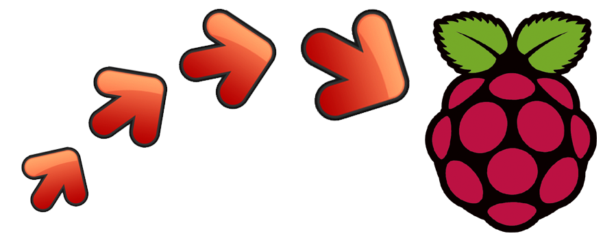

Compile StepMania on Raspberry Pi
=========================



Scripts & instructions to build [StepMania](https://github.com/stepmania/stepmania) from source on a Rasperry Pi running Raspian.

There is a lot more required to make StepMania actually _playable_ on a Raspberry Pi.
If all you want to do is play StepMania, check out
[`raspbian-3b-stepmania-arcade`](https://github.com/SpottyMatt/raspbian-3b-stepmania-arcade) instead.

1. [Prerequisites](#prerequisites)
2. [Quick Start](#quick-start)
3. [Notes](#notes)

Prerequisites
=========================

**You** must provide the following:

1. A supported [Raspberry Pi model](https://www.raspberrypi.org/products/)
	1. 3B
	2. 3B+
	3. 4B
2. An installed & working [Raspbian](https://www.raspberrypi.org/downloads/raspbian/) operating system, Stretch (v9) or later.

Quick Start
=========================

1. Clone this repository
2. Run `make`
3. Wait a while
	1. ~2 hours for Rpi 3B
	2. ~30 minutes for Rpi 4
4. Look in `/usr/local/stepmania-*`
5. Done!

**Note:** You've just _built_ the Stepmania binary but there's a lot more required to play it well on a Raspberry Pi.
For that, check out [`raspian-stepmania-arcade`](https://github.com/SpottyMatt/raspbian-3b-stepmania-arcade).

Notes
=========================

Building for Other Raspberry Pi Models
-------------------------

If you look at [`raspi-3b-arm.patch`](stepmania-build/sm-arm.patch), you'll see there are two variables that really matter for building StepMania:

1. `ARM_CPU`
2. `ARM_FPU`

See this excellent gist: [GCC compiler optimization for ARM-based systems](https://gist.github.com/fm4dd/c663217935dc17f0fc73c9c81b0aa845) for more information on compiling with GCC on Raspberry Pi.

In particular, it's got tables of the `ARM_CPU` and `ARM_FPU` values for other Raspberry Pi models.
Who knows, they might work! The regular 3B was just powerful enough to run StepMania acceptably; older models may struggle to perform.

Edit your `Makefile` and give it a try!

Supporting Other Raspberry Pi Models
-------------------------

If you manage to compile on some other Raspberry Pi model and want to extend this repository's support so that it just works for that new model, you'll need to expand the `rpi_models` list in [`rpi-hw-info.py`](stepmania-build/rpi-hw-info.py).

```python
rpi_models = [
        RPIModel( "3B", "a02082", "1.0", "20161", "cortex-a53", "neon-fp-armv8" ),
        RPIModel( "3B", "a22082", "1.1", "20161", "cortex-a53", "neon-fp-armv8" ),
        RPIModel( "3B", "a32082", "1.2", "20164", "cortex-a53", "neon-fp-armv8" ),
        RPIModel( "3B+", "a020d3", "1.3", "20181", "cortex-a53", "neon-fp-armv8" ),
        RPIModel( "4B", "a03111", "1.1", "20192", "cortex-a72", "neon-fp-armv8" ),
        RPIModel( "4B", "b03111", "1.1", "20192", "cortex-a72", "neon-fp-armv8" ),
        RPIModel( "4B", "c03111", "1.1", "20192", "cortex-a72", "neon-fp-armv8" )
]
```

The first four values for Raspberry Pi models can be found on this page of the Embedded Linux Wiki: [RPi Hardware History](https://elinux.org/RPi_HardwareHistory).
For the last two, you'll need to look up the hardware specifications of whichever Raspberry Pi you're trying to use.

StepMania Source
-------------------------

This uses a working commit from the [`5_1-new`](https://github.com/stepmania/stepmania/tree/5_1-new) branch of StepMania as the source code.
Probably the latest 5.1 _release_.

If you want to try building from a more recent commit, [update the `stepmania` submodule](https://stackoverflow.com/questions/5828324/update-git-submodule-to-latest-commit-on-origin/5828396#5828396) before building and installing.
